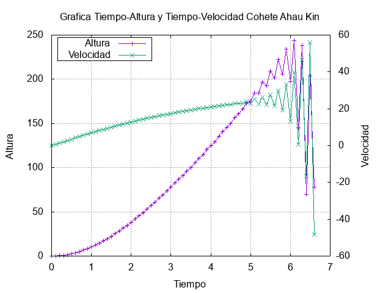

# Segundo Parcial
Fichero dedicado a los problemas resuleltos del segundo parcial para carné con terminación 9.

## [Problema 1](https://github.com/DSarceno/2022LabSimu201900109/blob/main/EXAMENFINAL/problema1.c)
El problema visto es que el la parte final de las gráficas, todo se vuelve loco, no se logró arreglar ese problema. Sin embargo, el resto esta correcto.

### Cohete Ah Mun


### Cohete Ah Mun




### Cohete Ah Mun


#### Instrucciones de Ejecución

```
$ gcc -Wall -pedantic -std=c11 -c -o problema1.o problema1.c
$ gcc -o problema1.x problema1.o -lm
$ ./problema1.x
```

Estas imprimen lo solicitado y generan el archivo de datos, así como las 6 gráficas. Es claro que se solicitaron 9 gráficas, sin embargo, se combinaron las dependientes del tiempo en 1 sola, para tener todo más compacto y vistoso.

## [Problema 2](https://github.com/DSarceno/2022LabSimu201900109/blob/main/EXAMENFINAL/problema2.cpp)

#### Instrucciones de ejecución

```
$ gcc -Wall -c -o problema2.o problema2.cpp
$ gcc -o problema2.x problema2.o -lm
$ ./problema2.x
```
