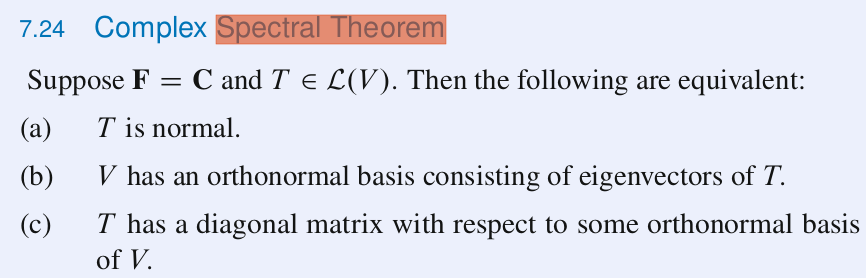

# Práctica 1

### Descarga e Instalación de la Máquina Virtual
Se inició la práctica descargando e instalando Debian como MV, dado que mi idea era realizar pequeñas grabaciones de la terminal mostrando el uso de cada uno de los comandos utilizando _asciinema_, se tuvo problemas al intentar ejecutar dicha instrucción. Con lo que, mejor descargue Ubuntu 20.04, y realizar todas las grabaciones y pruebas desde ahí, esto porque dado que mi sistema operativo es el mismo, era más familiar y sencillo instalarlo como MV y utilizarlo.

<figure>
  
  <figcaption>Se utilizaron 3GB de memoria RAM ya que cubre perfectamente la ejecución del entorno de GNOME; asímismo, para el espacio de disco, se destinaron únicamente 15GB, para no desperdiciar espacio.</figcaption>
</figure>  
   

Dicho esto, se procede a mostrar el uso de los comandos en terminal.
