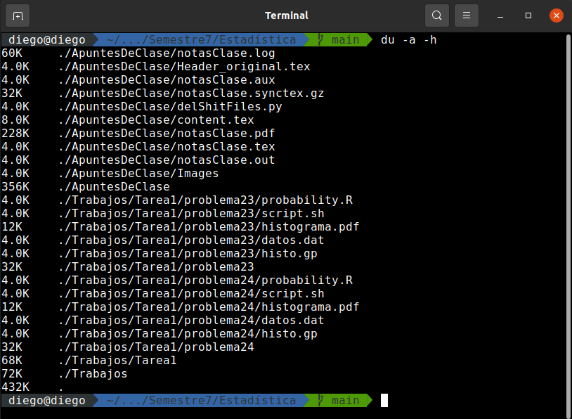

# Práctica 1

## Descarga e Instalación de la Máquina Virtual
Se inició la práctica descargando e instalando Debian como MV, dado que mi idea era realizar pequeñas grabaciones de la terminal mostrando el uso de cada uno de los comandos utilizando _asciinema_, se tuvo problemas al intentar ejecutar dicha instrucción. Con lo que, mejor descargue Ubuntu 20.04, y realizar todas las grabaciones y pruebas desde ahí, esto porque dado que mi sistema operativo es el mismo, era más familiar y sencillo instalarlo como MV y utilizarlo.

  <figure>
    
    <figcaption>Se utilizaron 3GB de memoria RAM ya que cubre perfectamente la ejecución del entorno de GNOME; asímismo, para el espacio de disco, se destinaron únicamente 15GB, para no desperdiciar espacio.</figcaption>
  </figure>  

  

Dicho esto, se procede a mostrar el uso de los comandos en terminal.

## Comandos en terminal
### Atajos de Teclado
Eliminación de Carácteres (el clásico _BackSpace_), Palabras (_Ctrl+w_) y Línea (_Ctrl+u_). Utilizando la terminal tengo cierta experiencia, pero el hecho de que existan atajos de teclado (como en cualquier otra aplicación) es muy interesante y útil. También es importante saber que los atajos de copiado y pegado son distintos, en concreto: Copiar -> Ctrl + Shift + C y Pegar -> Ctrl + Shift + V.

### Ayuda en la Terminal
De las formas de pedir ayuda, me gusta más la forma de desplegarse de _man_, la siento más intuitiva y simple. Tanto _--help_ como _info_ las considero como 2das opciones.

### Instrucciones Básicas
Las instrucciones básicas, son sumamente necesarias, no importa en que sistema operativo se esté trabajando; personalmente, entre dichas instrucciones incluiría la navegación entre ficheros, pero esto es un tema posterior. En específico, hay que tomar en cuenta que el cambio de contraseña debe cumplir con los requerimientos tradicionales (longitud y no puede ser igual a la contraseña antigua).

###  Instrucciones de Manejo de Directorios y Archivos
#### Navegación por Directorios
Los comandos `cd` y <code>ls</code> son de los comandos más utilizados y más útiles en la terminal. El comando <code>pwd</code>, es algo más situacional, en casos cuando necesitas realizar una copia de un archivo/directorio en algún otro directorio, utilizar ese comando para obtener la ruta completa es bastante útil.

#### Manejo de Directorios
El manejo de directorios desde la terminal parece no muy útil, puesto que generalmente se tiene la interfaz gráfica del directorio. Sin embargo, al estar trabajando desde terminal aveces es mucho más rápido el crear o renombrar un archivo desde ahí. La creación es bastante clara (<code>mkdir</code>), mientras que la elimnación de un directorio tiene dos formas <code>rmdir</code> para directorios vacíos y <code>rm -rf</code> para forzar el borrado. (No se probó la instrucción <code>rm</code> porque se me olvidó xd, pero es simplemente para eliminar archivos y/o directorios.). La instrucción <code>mv</code> funciona tanto para mover algo a otro directorio, como para renombrar.

#### Manejo de Archivos
Luego de la navegación por la terminal, los comandos más útiles son los de manejo de archivos. Creación con <code>touch</code>, visualización simple con <code>less</code> y <code>cat</code> (<code>more</code>), o visualización personalizada con <code>head</code> y <code>tail</code> con las cuales se puede escoger el número de líneas a visualizar (-n <número de líneas>). Además se tiene el comando <code>file</code> al cual no le he encontrado una gran utilidad hasta ahora.

### Comandos Extras
(Para este use mi sistema operativo, no la máquina virtual, ambos son ubuntu 20.04, así que no hay problema). El comando <code>which</code> muestra la ruta de algún ejecutable, según entiendo, es el comando que más duda me genera. Para <code>sudo</code> tenemos los permisos de superusuario. No conocía el comando <code>history</code>, es bastante útil sabiendo que en algún momento se "buguee"/"crashee" algo, tener la bitácora de lo que se hizo.

### Combinación de Instrucciones
Como en mathematica, la idea es simplificar el código lo más posible, haciendo que se puedan realizar instrucciones complejas en el menor espacio posible. En el video, la última instrucción no ejecute el comando <code>ls</code> para verificar si se creó el archivo *sample.txt*, pero adjuntaré una imagen del comando ejecutado y del <code>ls</code>.

  <figure>
    
  </figure>  

  

### Instrucciones Poderosas y Peligrosas
  - <code>grep</code>: Esta instrucción busca un patrón específico en un archivo de texto (nosotros definimos ese patrón). Esto a priori es bastante inutil; sin embargo, y considerando la complejidad del análisis léxico, es uno de los comandos más versátiles que hay. Es bastante interesante el hecho que desde la terminal se pueda realizar esto. (Adjunto un pequeño programa de análisis léxico que realizé hace un tiempo: [Link](https://github.com/DSarceno/Semestre5/blob/main/Programaci%C3%B3n2/Trabajos/Practica3/analizador.py)). Aquí muestro un ejemplo bastante simple de lo que <code>grep</code> puede hacer:
  

    <figure>
      
    </figure>  
  

    
  - <code>ps</code>: Este comando muestra los procesos que están en ejecución en dicho momento, como es de esperarse tiene muchas opciones para mostrar de manera más legible y/o un contenido más amplio. Es un comando que puede llegar a ser bastante útil si se dejan programas ejecutandose en segundo plano y cosas por el estilo. En la penúltima línea de la segunda terminal, se puede ver perfectamente que el ejecutable _mainRF.x_ lleva 10 segundos en ejecución.
  

    <figure>
      
    </figure>  
  

    
  - <code>kill</code>: Este comando, por defecto, sirve para matar/terminar un proceso en ejecución, interactuando por medio de su PID. [Wikipedia](https://es.wikipedia.org/wiki/Kill#:~:text=En%20Unix%20y%20los%20sistemas,limpiar%20su%20estado%20y%20salir.) explica bastante bien esto. La prueba la haré matando la ejecución del programa mostrado anteriormente.
  

    <figure>
      
    </figure>  
  

    
  - <code>find</code>: Este comando permite buscar la ubicación de algún archivo por medio del nombre, extención, tamaño, permisos, etc. Lo que lógicamente lo hace super útil por su flexibilidad. En el ejemplo utlizo el comando para buscar todos los archivos con extension <code>.pdf</code> en la carpeta que tengo para análisis numérico y un archivo en específico de mecánica cuántica.
  

    <figure>
      
    </figure>  
  

    
  - <code>du</code>: Este comando muestra el espacio total de disco utilizado en un directorio respectivo. En el ejemplo siguiente se muestra la opcion <code>-a</code> para mostrar todos los archivos (no solo directorios) y <code>-h</code> para mostrarlo de forma legible para nosotros.
  

    <figure>
      
    </figure>  
  

    

## Manejador de Paquetes y Comandos en Super Usuario
Se realizó lo solicitado en la práctica, sin embargo no estoy seguro de haber comprendido bien el por qué se realizó esto. Según yo quitaba la necesidad de solicitar permisos de superusuario al usuario, valga la redundancia, seleccionado. En el video se puede ver claramente que esto no es así, por eso los primeros errores.

Instalación de _vim_ y _git_.

### Últimos Comandos
Al ejecutar <code>rm -rf /*</code> se puede ver que no deja eliminar ningún directorio, asumo que, dado que son absolutamente todos los directorios, es necesario permisos de superusuario.

  <figure>
    
  </figure>  

  

Dado esto, se ejecutó el mismo comando con permisos de super usuario, lo que terminó en:

  <figure>
    
  </figure>  

  

Creo que era de esperarse, ya que estamos eliminando todo..., luego de esto ya no era posible ejecutar ni <code>cd /ect</code> ni el calendario.
