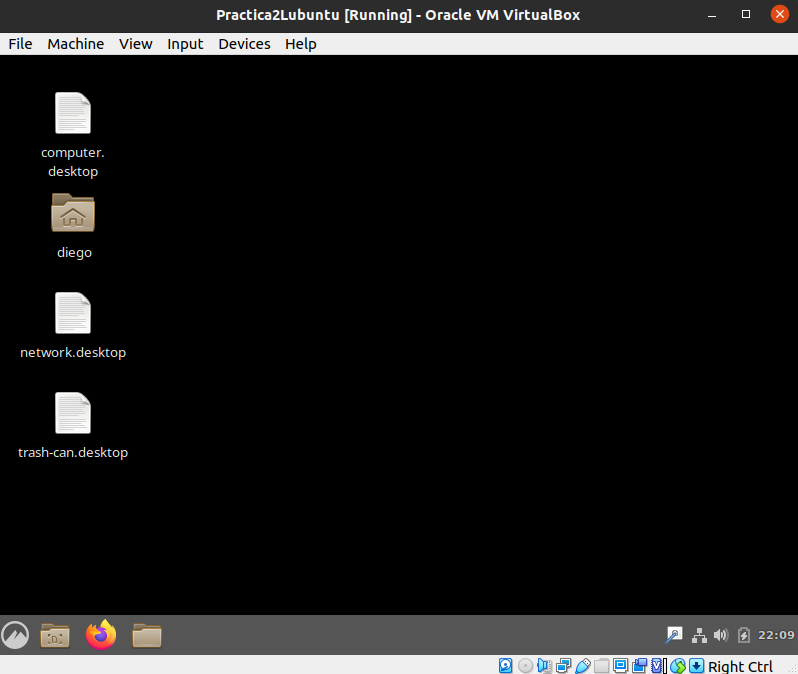
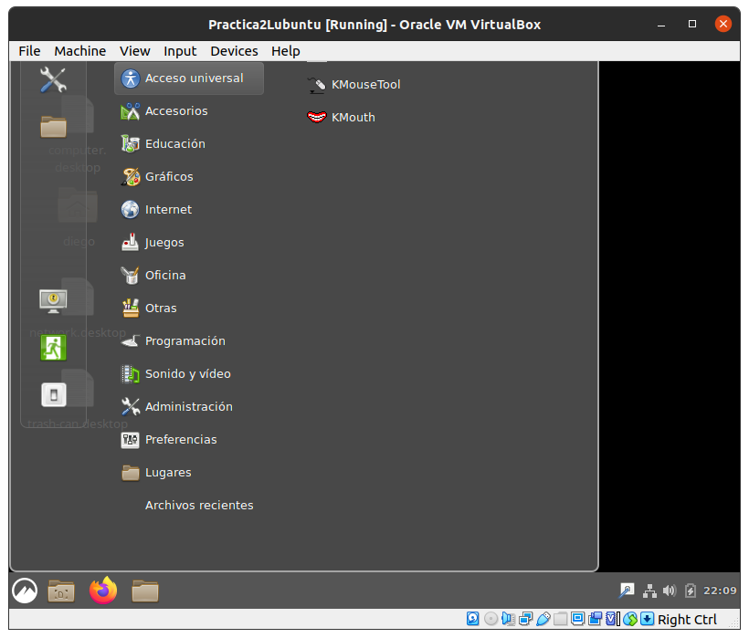
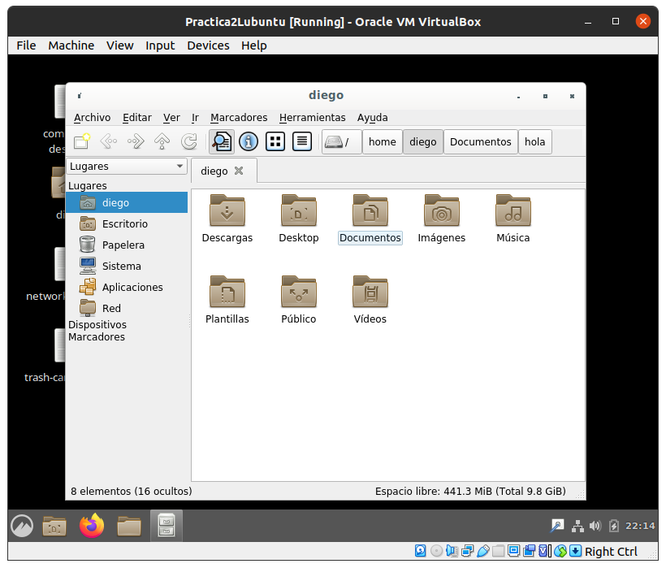
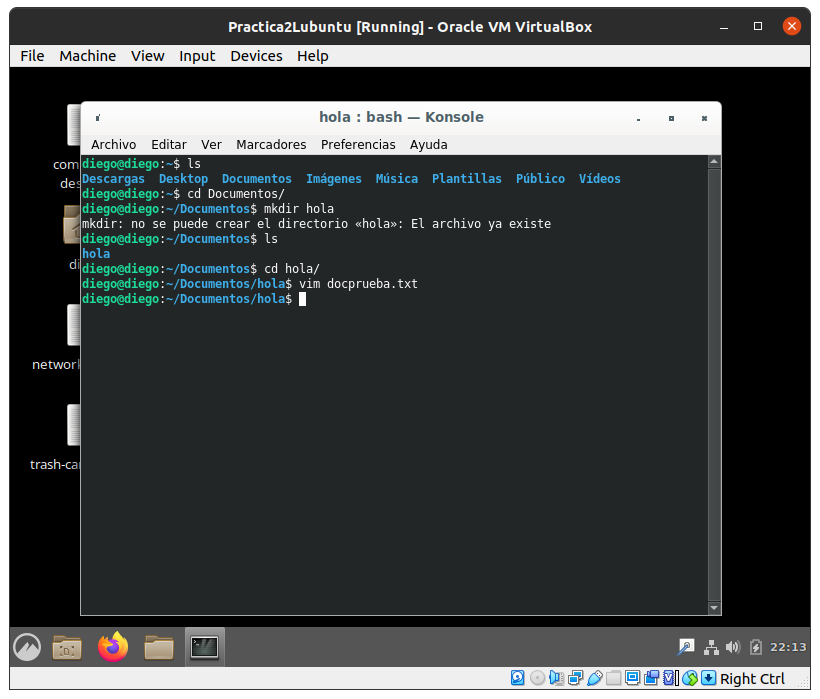
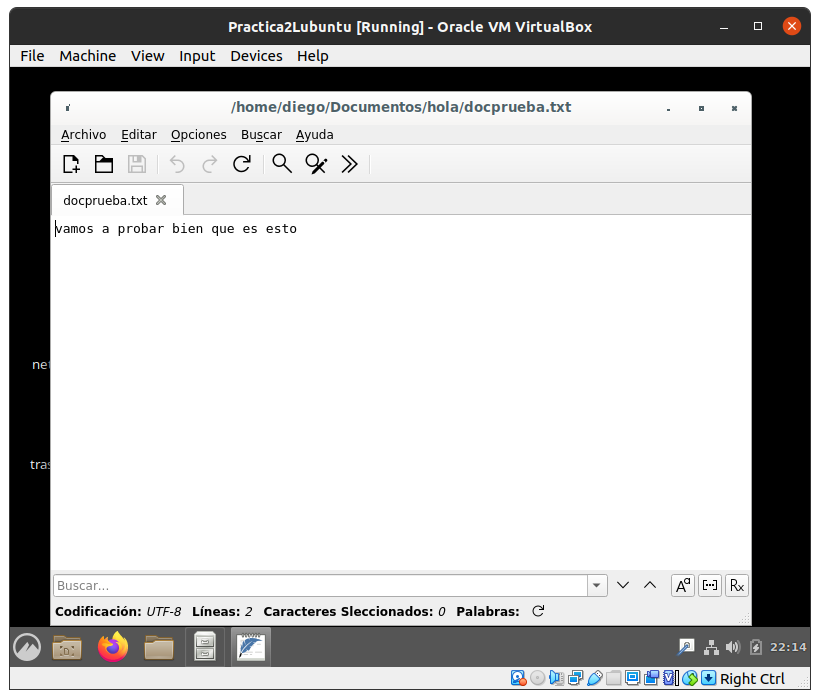
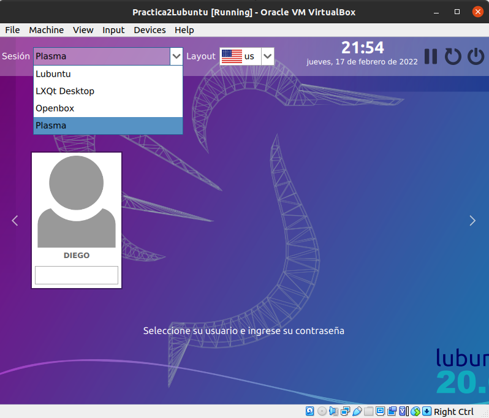
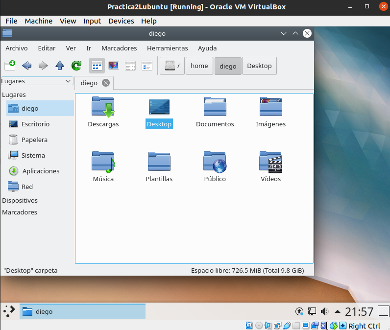
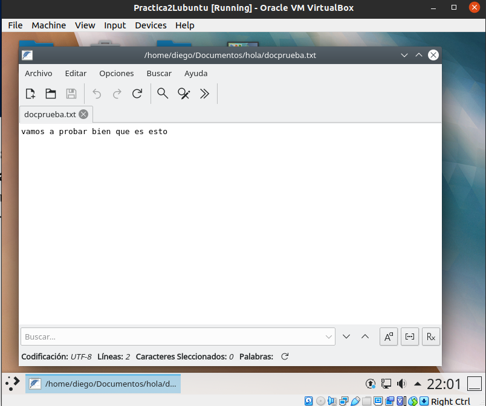
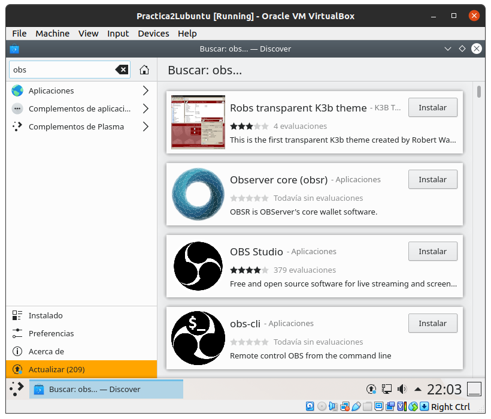

# Práctica 2

## Entornos de Escritorio

| ENTORNO | KDE Plasma | MATE | GNOME | CINNAMON | BUDGIE | XFCE |
| ------- | --- | ---- | ----- | -------- | ------ | ---- |
| GENERALIDADES | KDE es un entorno de software libre, es utilizable en sistemas como GNU/Linux, Mac y Windows. KDE fue creado para llenar la necesidad de un entorno amigable similar a los escritorios de mac y windows. | Entorno derivado de GNOME 2, tiene un estilo conocido de Linux y otros sistemas Unix. | Es un entorno de escritorio creado por el proyecto GNU, el cual está disponible para multiples distribuciones, la más conocida, Ubuntu. La interfaz gráfica esta creada utilizando la librería Gtk. | Un proyecto iniciado como una bifurcación de GNOME, ofrece un escritorio más tradicional como GNOME 2. Al igual que GNOME, su interfaz es basada en Gtk. | Es un entorno que utiliza tecnologías GNOME desarrollado por Solus en colaboración con Arch y Manjaro Linux. | Desde su página oficial describen este entorno como ligero para sistemas tipo UNIX. Buscando la eficiencia y velocidad sin perder la facilidad en su uso. Creado con Gtk+.
| CARÁCTERÍSTICAS | Escrito casi completamente en C, construido con la bilbioteca Qt. Cuenta con su propio sistema de entrada y salida. Utiliza _Dophin_ como navegador de archivos, _konsole_ como emulador de terminal y _konqueror_ como navegador web y de archivos, entre otras características. | Utiliza _Caja_ como gestor de archivos, _Pluma_ como editor de texto, _Atril_ como visor de documentos y la terminal _MATE_. | Utiliza _Nautilus_ como navegador de archivos, _Evince_ como visor de documentos para múltiples formatos y  _Epiphany_ como el web browser base. Entre otras. | Muchas de las extenciones son importadas de GNOME 3, con la salvedad de que ofrece más efectos de escritorio y animaciones del mismo. Se ahondará más en las características al probar dicho entorno. | Dado que es a base de otras distribuciones, posee características de las mismas. Una de las diferencias es que Budgie crea una lista de facoricos, moviento categoríasy apps hacia la parte superior de los menus, esto lo hace automáticamente mientras el usuario trabaja. | Utiliza el gestor de ventanas _Xfwm_, _Thunar_ como administrador de archivos, varias otras aplicaciones sencillas y ligeras, además, este entorno no cuenta con navegador incluído, sin embargo, se recomienda el uso de **Midori**. |

### Entorno CINNAMON
Este entorno se instaló con el comando `sudo apt install cinnamon`, corrió todo correctamente. Al iniciar el entorno virtual, no se si era bug o así es normalmente pero, no tiene imagen de fondo predeterminada como el resto de entornos.

El navegador de archivos es bastante feo en estética, al igual que el KDE (como se verá posteriormente), posee bastante formas de interacción con los archivos, sin embargo, no es nada que no se pueda realizar con la terminal de una forma sencilla.

La terminal es bastante estándar, no hay mucho que comentar al respecto.

El editor de archivos estándar es bastante completo, muy útil y bastante simple de utilizar en caso de ser necesario.

En general, es un sistema estéticamente tosco, existen otros entornos más vistosos y que incluso puedan ofrecer más de sí, como extenciones o mejores "upgrades".

### Entorno KDE
Este entorno se instaló con el comando propuesto en la práctica `sudo apt install kde-full` con esto, se esperó a que se instalaran todos los paquetes y las dependecias. Ya con todo listo, se reinició la máquina virtual y se inició sesión

Dado esto, se empezó a "trastearse". El entorno de navegación de archivos es bastante tosco para lo que se leyó, es muy parecido a Windows. No me pareció estéticamente bonito ni algo mucho más útil que otros entornos de navegación.

La terminal en KDE es prácticamente como se vió en Cinnamon, no cambia en prácticamente nada al igual que el editor de texto, como se vió, es practicamente igual.

A diferencia del Gestor de Aplicaciones, en KDE es bastante similar al que se tiene por default en Ubuntu. En donde es incluso más fácil de utilizar que los el Market Place de Windows.

Desde mi punto de vista, KDE no es un escritorio que valga más la pena que el que trae por defecto Ubuntu/Debian, es un entorno fácil de utilizar, pero no más llamativo y estéticamente pobre en ciertos aspectos.
  

Dado esto, desde mi opinion personal y mi experiencia utilizando GNOME, he de decir que, a pesar de que GNOME pueda utilizar un poco más de recursos computacionales, sigue siendo bastante superior en cuanto balance estética-utilidades. Esperaba bastante más del entorno KDE, y estaba bastante interesado en el entorno Cinnamon, entre estos dos, si tuviera que escoger, tomaría KDE.
