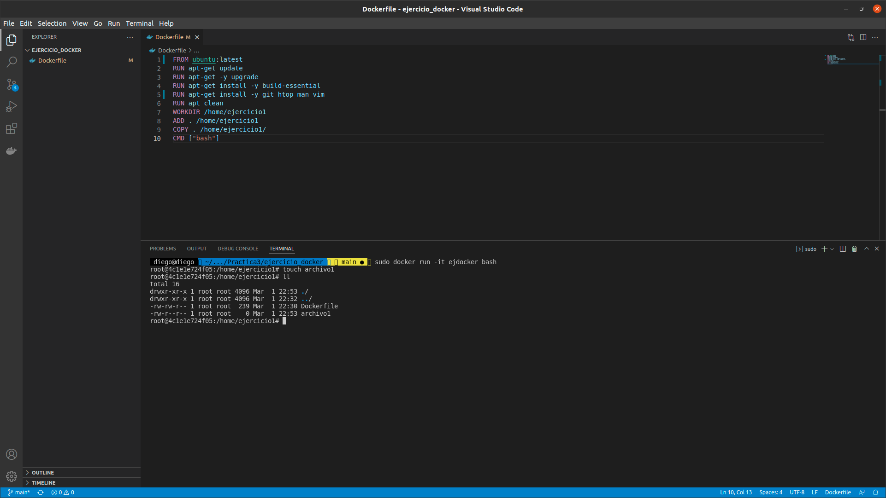

# Práctica 3

## Docker
Comprobamos que docker esta bien instalado y corre bien, utilizando el "Hello World"

[](https://asciinema.org/a/470883)

### Dockerfile
En el Dockerfile creado con los comandos dados


en el cual, cada línea de código, realiza lo siguiente
  - `FROM ubuntu:lastest`: Utiliza la última versión de ubuntu para la Imagen.
  - `RUN apt-get update`: Actualiza la lista de paquetes disponibles para Ubuntu.
  - `RUN apt-get -y upgrade`: Acualiza los paquetes nombrados en la lista (La instrucción `-y` le dice al sistema que se acepte todos los _prompts_, un _yes_ automático).
  - `RUN apt-get install -y build-essential`: Instala todos los paquetes necesarios para poder compilar _C_ en el sistema.
  - `RUN apt-get -y git htop man vim`: Instala la herramienta _htop_, la cual nos permite ver el uso de los recursos vitales del sistema. Además, instala _git_, _man_ (manuales de los comandos) y _vim_.
  - `RUN apt clean`: Este comando ayuda a limpiar el cache luego de una instalación, remueve los archivos y ficheros que dejaron de ser útiles para el sistema.
  - `WORKDIR /home/ejercicio1`: Define el directorio de trabajo (_working directory_) de un _Docker Container_.
  - `ADD . /home/ejercicio1`: Copia directorios y archivos en una imagen de Docker.
  - `COPY . /home/ejercicio1/`: Únicamente copia/duplica archivos y/o directorios.
  - `CMD ["bash"]`: Corre _bash_ en __CMD__.

Ya con esto dicho, creamos la imagen con el nombre __ejdocker__ desde la terminal de _vscode_. (Si se corrijió el "latest" que estaba mal escrito.)
```
$ docker build -t ejdocker:latest .
```
Ejecución del comando


No se terminó la ejecución dado que se tuvo un problema con la linea 5 del Dockerfile, en concreto con git. Se me ocurrió, quitar git de ahí para ver que pasa.


Luego de un rato probando y teniendo errores, me di cuenta que me faltó la palabra _install_ previa a la instrucción _-y_. Ya con esto, el primer comando dejó de tener errores.


Se ejecutó el primer comando para correr la imagen de docker
```
$ sudo docker run -it ejdocker bash
# touch archivo1
```
El cual creo un archivo, pero al cerrar el docker y volverlo a iniciar con el mismo comando, no aparecía el archivo.



Al utilizar el segundo comando
```
$ sudo docker run -it -v /home/diego/Documents/Simulation-Lab/Practicas/Practica3/
      ejercicio_docker:/home/ejercicio1 -w /home/ejercicio1 ejdocker bash
```

Se crea el _archivo2_, el cual si se guarda, no importa cuando se cierra, el archivo permanece. A continuación se muestra el _vscode_ con el archivo creado, y la terminal usada


## Bash Script
Para los ejercicios en _bash_ se utilizó docker, corriendo la imagen con el segundo comando.
### Ejercicio 1
Para este ejercicio se investigó hacerca de la instrucción `curl`, en el cual, se encontró la etiqueta `-o`, en la cual filtra toda la información obtenida en un archivo.


Ya con esta información se creó la primera versión del _"ejercicio1.sh"_. El código fucionó; sin embargo, el código se muestra en forma de fila, no columna, pero se muestran las primeras 7 líneas. El código hecho es:


Los símbolos en _?_ son tíldes y ñ's.

### Ejercicio 2
Para este ejercicio se utilizó la función `echo` con la etiqueta `-e`, en el cual se escriben las líneas propuestas en un archivo con el nombre ingresado por el usuario. Este "input" se debe hacer sin la extensión desdeada.


El resultado de esto se muestra en lo siguiente:


Yo llevé el curso de Física Computacional el año pasado con Giovanni, él nos proporcionó un header para ser utilizado, y desde entonces, uso dicho header y la forma que nos dio para compilar archivos, por eso se muestran dos líneas en la comílación.
```
$ gcc -Wall -pedantic -std=c11 -c -o haber.o haber.c
$ gcc -o haber.x haber.o
```
En donde la instrucción `-Wall` muestra todas las advertencias, `-pedantic -std=c11` muestra todos los errores en base a la versión 11 de _C_ y `-c` es para que no enlace el archivo con el ejecutable (No recuerdo bien la razón de esto, pero desde entonces lo he hecho así y me ha funcionado).


#### Otro Header
Utilizando la misma idea del header normal, se tiene la versión proporcionada por Giovanni, obviando la parte de la licencia de _GNU_.


Se muestra exactamente la misma cantidad de información, pero de otra forma. Se crearon ambos ejecutables `.sh`.


## Git y GitHub
Para este curso ya había creado un repositorio local y su respectivo repositorio en _GitHub_ desde la práctica 1, le cambié el nombre a _"2022LabSimu201900109"_ y el repositorio puede ser encontrado en el siguiente [link](https://github.com/DSarceno/2022LabSimu201900109) (en el que se pueden ver todas las especificaciones dadas, tales como la licencia del MIT, las carpetas solicitadas, etc.). Se creó la carpeta [_Bash_](https://github.com/DSarceno/2022LabSimu201900109/tree/main/Bash) y se añadieron los ejercicios 1 y 2 a la carpeta.


Ya con la carpeta creada se crea el archivo _elementos.txt_ y se añade al `.gitignore`.


Yo para hacer el `git status`, `git add`, `git commit -m {$1}` y `git push`, tengo dos comandos que fusionan varios de estos en uno solo. Estos dos comandos son `gs` para el `git status` y `acp "{$1}"` para el `git add`, `git commit -m {$1}` y `git push`. Con esto agrego todo al repositorio local y directamente al repositorio remoto en GitHub.


Con esta útilma imagen se puede ver que el archivo _elementos.txt_ si existe en el repositorio local, pero en el remoto no aparece, por lo que el `.gitignore` si está funcionando.
