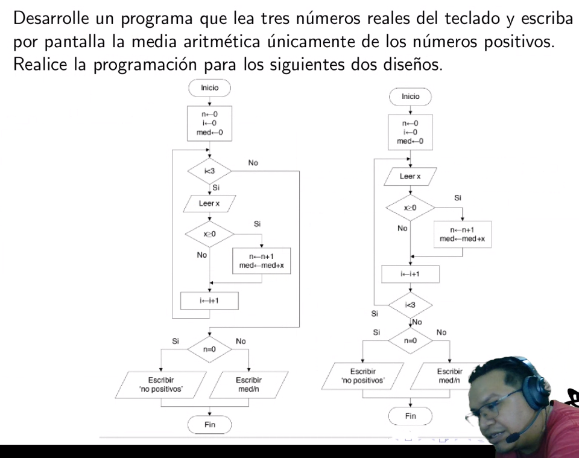
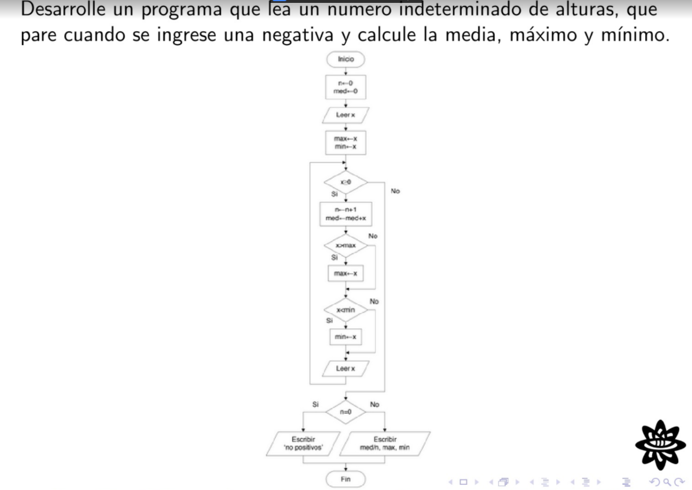
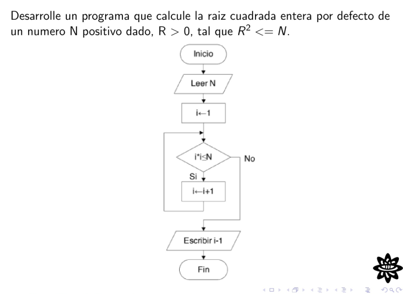
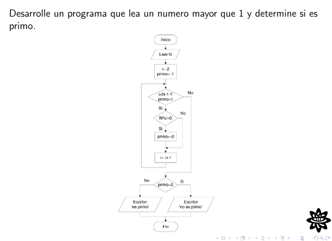
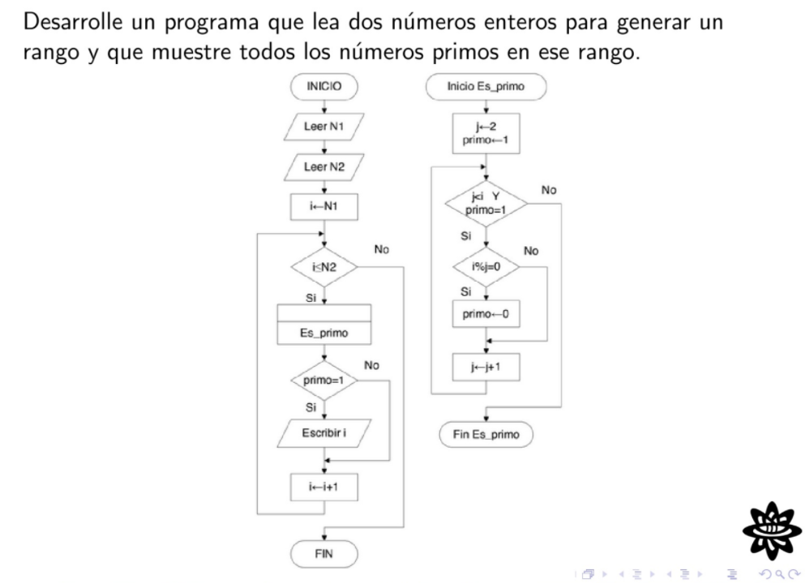
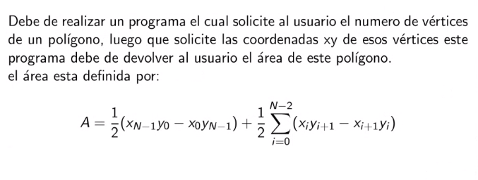

# Problemas de Programación
En este fichero se encuentran todos los problemas dejados en clase.

## [Problema 1](https://github.com/DSarceno/2022LabSimu201900109/blob/main/ProblemasProgramaci%C3%B3n/problema1For.c)
Enunciado del problema:


**Variables Declaradas:**
  - `x`: input del usuario (número real).
  - `i`: iterador.
  - `n`: cantidad de números positivos ingresados.
  - `media`: suma de los números positivos, posteriormente se difidirá entre `n`.

**Instrucciones de Ejecución y Compilación:**

*Programa realizado con el ciclo For:*
```
$ gcc -Wall -pedantic -std=c11 -c -o problema1For.o problema1For.c
$ gcc -o problema1For.x problema1For.o
$ ./problema1For.x
```

*Programa realizado con el ciclo While:*
```
$ gcc -Wall -pedantic -std=c11 -c -o problema1While.o problema1While.c
$ gcc -o problema1While.x problema1While.o
$ ./problema1While.x
```

## [Problema 2](https://github.com/DSarceno/2022LabSimu201900109/blob/main/ProblemasProgramaci%C3%B3n/problema2.c)
Enunciado del problema:


**Variables Declaradas:**
  - `x`: input del usuario (número real).
  - `n`: cantidad de números positivos ingresados.
  - `media`: suma de los números positivos, posteriormente se difidirá entre `n`.
  - `max`: número máximo ingresado.
  - `min`: número mínimo ingresado.

**Instrucciones de Ejecución y Compilación:**
```
$ gcc -Wall -pedantic -std=c11 -c -o problema2.o problema2.c
$ gcc -o problema2.x problema2.o
$ ./problema2.x
```

## [Problema 3](https://github.com/DSarceno/2022LabSimu201900109/blob/main/ProblemasProgramaci%C3%B3n/problema3.c)
Enunciado del problema:


**Variables Declaradas:**
  - `i`: iterador y raíz entera, el *output* es `i-1`.
  - `N`: número ingresado por el usuario.


**Instrucciones de Ejecución y Compilación:**
```
$ gcc -Wall -pedantic -std=c11 -c -o problema3.o problema3.c
$ gcc -o problema3.x problema3.o
$ ./problema3.x
```

## [Problema 4](https://github.com/DSarceno/2022LabSimu201900109/blob/main/ProblemasProgramaci%C3%B3n/problema4.c)
Enunciado del problema:


**Variables Declaradas:**
  - `i`: iterador y divisor en la operación módulo (`%`) para de terminar si un número tiene o no divisores.
  - `primo`: booleano que determina si el número es primo o no (variable de control).
  - `N`: número ingresado por el usuario.


**Instrucciones de Ejecución y Compilación:**
```
$ gcc -Wall -pedantic -std=c11 -c -o problema4.o problema4.c
$ gcc -o problema4.x problema4.o
$ ./problema4.x
```

## [Problema 5](https://github.com/DSarceno/2022LabSimu201900109/blob/main/ProblemasProgramaci%C3%B3n/problema5.c)
Enunciado del problema:


**Variables Declaradas:**
  - `n1`: número inicial del intervalo (input del usuario).
  - `n2`: número final del intervalo (input del usuario).

**Funciones utilizadas**
  - `es_primo`: recibe un número y determina si es primo, devuelve un valor
    booleano: 0 si no es primo y 1 si lo es.


**Instrucciones de Ejecución y Compilación:**
```
$ gcc -Wall -pedantic -std=c11 -c -o problema5.o problema5.c
$ gcc -o problema5.x problema5.o
$ ./problema5.x
```


## [Problema 6](https://github.com/DSarceno/2022LabSimu201900109/blob/main/ProblemasProgramaci%C3%B3n/problema6.c)
Enunciado del problema:


**Variables Declaradas:**
  - `n`: Cantidad de vértices del poligono.
  - `sum`: Variable de almacenamiento de la súma mostrada en la fórmula.
  - `A`: Output, área del poligono.
  - `x`: Array de almacenamiento de las coordenadas en x.
  - `y`: Array de almacenamiento de las coordenadas en y.


**Instrucciones de Ejecución y Compilación:**
```
$ gcc -Wall -pedantic -std=c11 -c -o problema6.o problema6.c
$ gcc -o problema6.x problema6.o -lm
$ ./problema6.x
```
