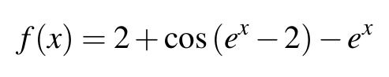

# Segundo Parcial
Fichero dedicado a los problemas resuleltos del segundo parcial para carné con terminación 9.

## [Problema 1](https://github.com/DSarceno/2022LabSimu201900109/blob/main/SegundoParcial/problema1.c)
#### Enunciado
Se elabora un estudio del comportamiento de los precios del combustible tipo regular, asumiendo que
estos tiene un comportamiento lineal y en base a la tabla de datos:

| Semana | Precio (Q/galon) |
| ------ | ---------------- |
| 1 | 20.20 |
| 2 | 20.90 |
| 3 | 20.60 |
| 4 | 21.30 |
| 5 | 20.75 |
| 6 | 22.05 |
| 7 | 23.62 |
| 8 | 22.95 |
| 9 | 23.80 |
| 10 | 24.00 |

#### Metodología
Dado el conjunto de datos, para realizar un ajuste lineal se pueden realizar dos procedimientos, utilizando **_gnuplot_** o algún método, en este caso, mínimos cuadrados. El ajuste en **_gnuplot_** se realiza mediante la función a la que se desea ajustar y las constantes presentes en dicha función, i.e.
```
# Función sobre la cual se "fitean" los datos
f(x) = a*x + b # en este caso función lineal

# Comando fit para el Ajuste
fit f(x) 'data.dat' using 1:2 via a,b
```
Ahora, utilizando el método de mínimos cuadrados, se encuentra la pendiente y el intercepto de la ecuación lineal.


Y el coeficiente de correlación.


#### Variables y funciones
- `x`: Vector que almacena las coordenadas "x" de los datos.
- `y`: Vector que almacena las coordenadas "y" de los datos.
- `i`: iterador en las funciónes.
- `n`: longitud de los vectores.
- `m`: Pendiente de la recta.
- `b`: Intercepto de la recta.
- `r`: Coeficiente de correlación.
- `suma_prod(vector,vector)`: función que calcula el producto punto entre ambos vectores.
- `suma(vector)`: Función que calcula la suma de todas las coordenadas del vector.


#### Diagrama de Flujo

#### Instrucciones de Complilación y Ejecución
```
$ gcc -Wall -pedantic -std=c11 -c -o problema1.o problema1.c
$ gcc -o problema1.x problema1.o -lm
$ ./problema1.x
```

#### Resultados
|  | m | b | r |
| - | - | - | - |
| Mínimos Cuadrados | 0.445515 | 19.666668 | 0.964707 |
| Ajuste Gnuplot | 0.445515 | 19.6667 | Not given. |

**Gráfica Mínimos Cuadrados**


**Gráfica Ajuste Lineal _Gnuplot_**


## [Problema 2](https://github.com/DSarceno/2022LabSimu201900109/blob/main/SegundoParcial/problema2.c)
#### Enunciado
Utilizando un método numérico, encuentre una raı́z de la ecuación



Debe de realizar la gráfica de la ecuación y comparar el resultado obtenido con el programa realizado en C.

#### Metodología
Para encontrar la raíz de la función dada se utilizó el método de **Bisección**, el cual consiste en ingresar un límite inferior y uno superior sobre los cuales la raíz deseada esté acotada. Por medio de valuaciones de los limites y el punto medio del intervalo se va achicando el intervalo siempre que se encuentre un resultado con signos distintos. El algoritmo es el siguiente:

Dados los extremos del intervalo, se calcula p = (inflim + suplim)/2. Con esto se inician las iteraciones validando:

  Si f(inflim)*f(p) > 0 (es decir que no se tiene cambio de signo en el intervalo (inflim,p)) entonces se quita el límite inferior y se sustituye por p, i.e. inflim = p. En otro caso se quita el límite superior, suplim = p. El bucle para debido a que se superaron las iteraciones o la distancia entre ambos límites es menor a la tolerancia.

#### Variables
- `x_inicial`: Limite inferior que acota la raíz.
- `x_final`: Limite superior que acota la raíz.
- `iteraciones`: Número máximo de iteraciones.
- `tolerancia`: Diferencia máxima entre los valores de los límites para que el resultado sea válido.
- `f(x)`: Función dada en el problema.
- `biseccion(inflim, suplim, iteraciones, tolerancia)`: Función que aplica el método de bisección explicado anteriormente.

#### Diagrama de Flujo


No aparece en el diagrama de flujo, pero obviamente la otra función utilizada es la función dada en el problema.

#### Instrucciones de Complilación y Ejecución
```
$ gcc -Wall -pedantic -std=c11 -c -o problema2.o problema2.c
$ gcc -o problema2.x problema2.o -lm
$ ./problema2.x
```

#### Resultados
El valor obtenido de la raíz por medio del método de **bisección** es: (1.007624,0). Comparado con la gráfica de la función sería


